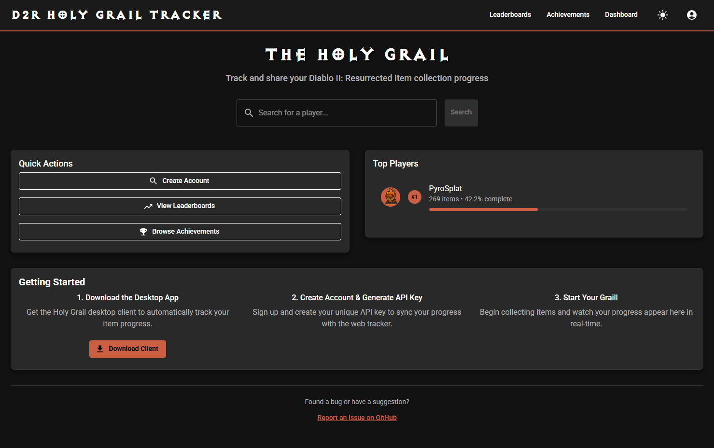

# TheHolyGrail-Public-Tracker

**D2R Grail Webapp** is a web application for sharing and tracking Diablo II: Resurrected *Holy Grail* progress. It offers features like user achievements, ranking leaderboards, player profile pages, and real-time synchronization with the desktop Holy Grail application.  

## Features

- 🏆 **Achievement System** - Unlock milestones and special achievements
- 📊 **Leaderboards** - Compare your progress with other players  
- 📈 **Real-time Sync** - Automatic progress updates from desktop app
- 🎮 **Player Profiles** - Public profiles with detailed statistics
- 📱 **Responsive Design** - Works on desktop and mobile
- 🌙 **Dark Theme** - Matches the desktop app's Diablo-inspired design

---

## Screenshots
Here are some sample screenshots from the app (assumed to be in the `images/` directory):

  
*(Description: The Grail webapp dashboard showing recent achievements and leaderboard highlights)*

  
*(Description: Display all users progress and filter by grail selections)*

  
*(Description: Profile of a player displaying progress, stats, and achievements)*

  
*(Description: Player milestones and achievement progress)*

  
*(Description: Generate a unique api key to link your client app with the web server)*
>>>>>>> 39c584ea634be74507496b13779aa0b07348acbc
